# 血染钟楼AI说书人辅助工具

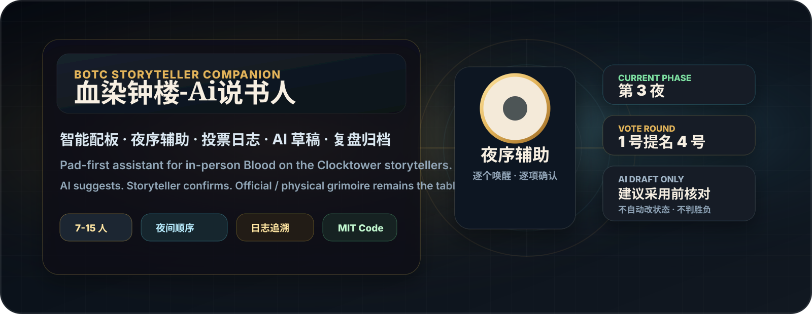

> <strong>手机 / 平板用户：</strong>通过 HTTPS 打开部署地址后，可以安装到主屏幕。首次完整打开后，配板、身份交接、夜序、投票、日志和本机复盘可离线使用；真实 AI 和云端归档仍需联网。

> <strong>Windows 用户：</strong>查看 [简洁安装教程](安装教程.md)。请从 Releases 下载 `botc-storyteller-companion-windows-portable.zip`，不要下载源码 ZIP。

## 界面预览

### 本局总览

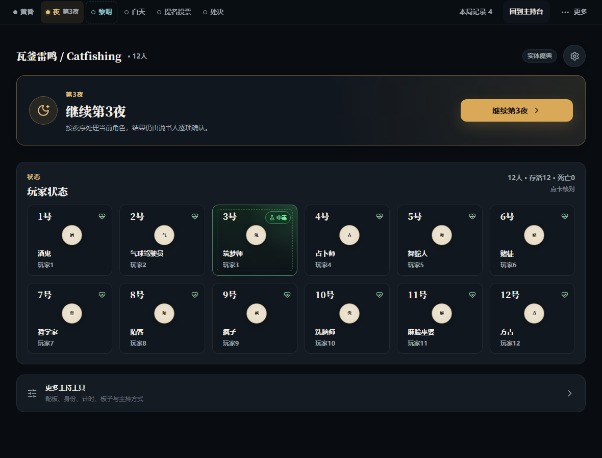

### AI 配板与调整

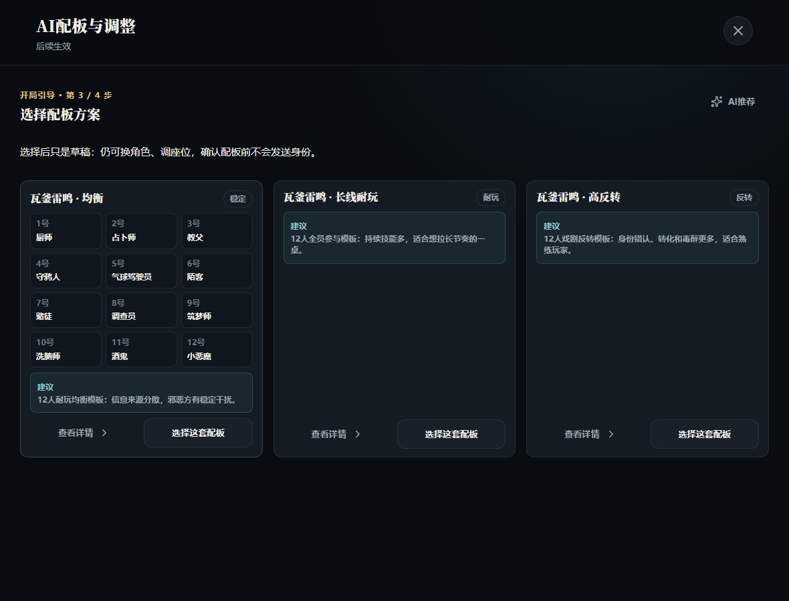

### 夜间工作台

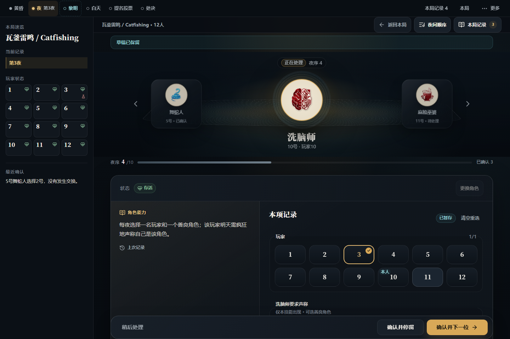

### 手机主持台

<p align="center">
  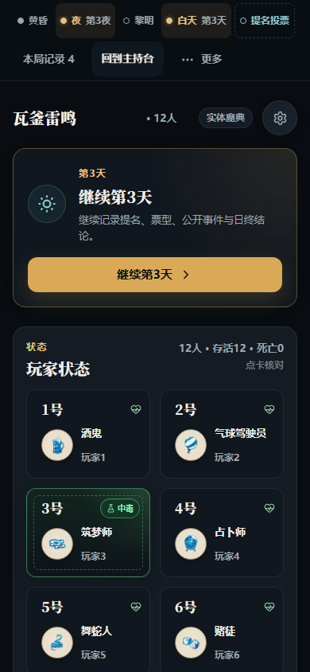
</p>

### 手机单人身份展示

<p align="center">
  
</p>

<details>
<summary><strong>展开查看完整界面图库</strong></summary>

| 板子库 | 发身份 |
| --- | --- |
| 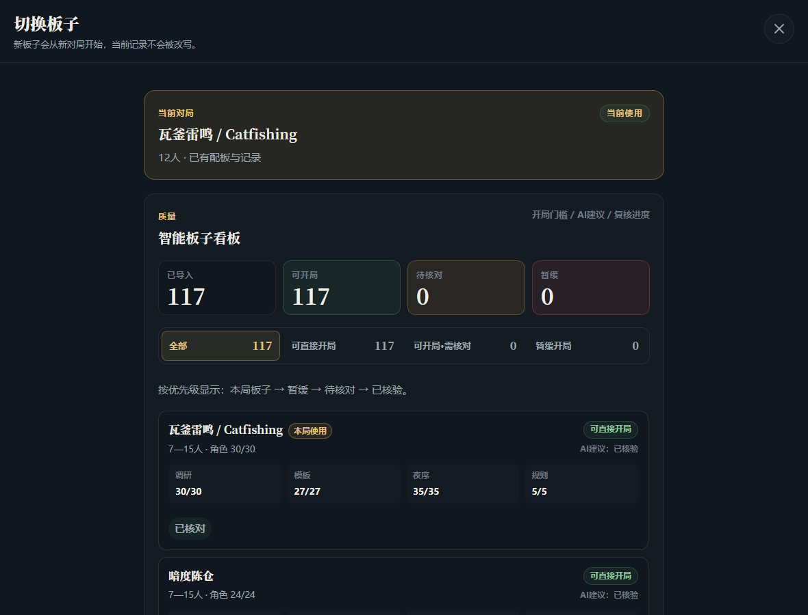 | 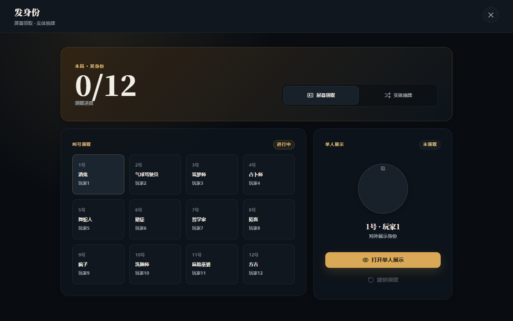 |

| 白天投票 | 公聊倒计时 |
| --- | --- |
| 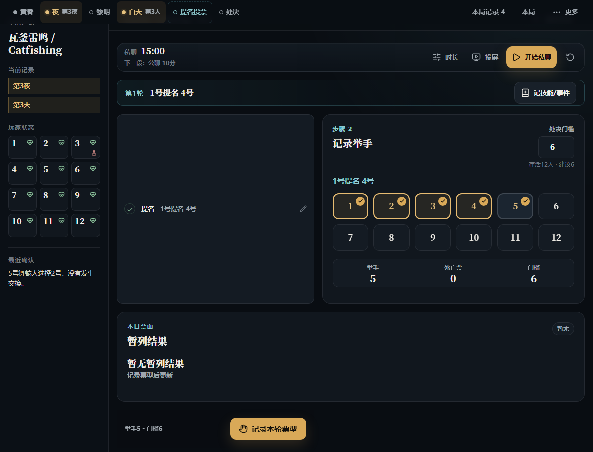 | 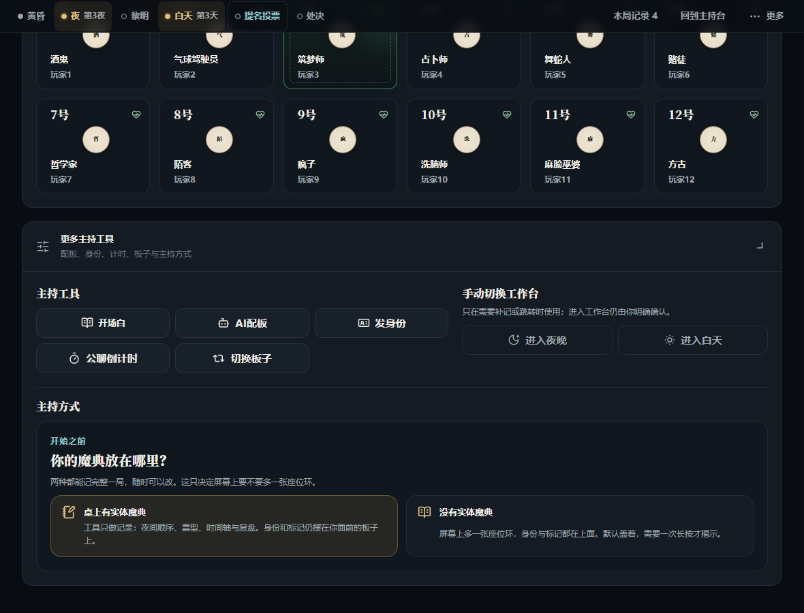 |

| AI 设置 | 开场白展示 |
| --- | --- |
| 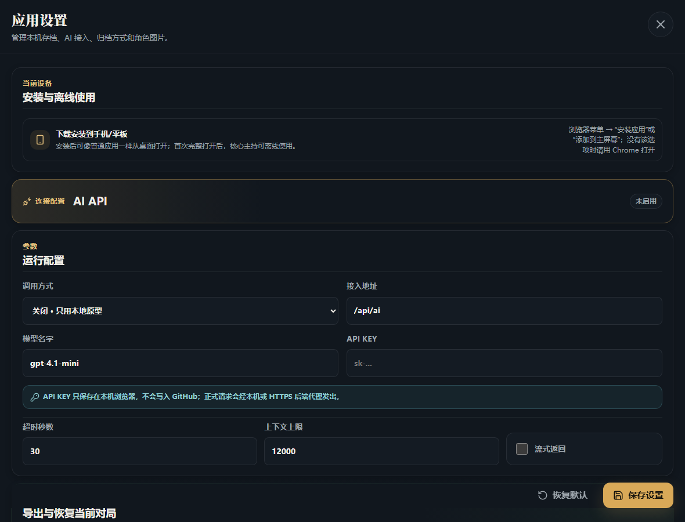 | 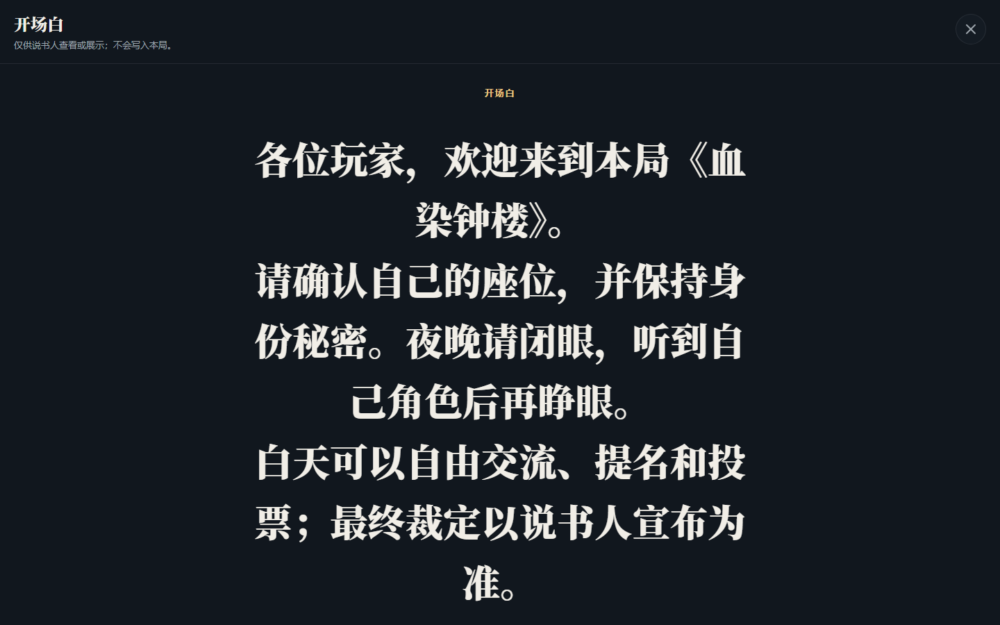 |

| 玩家详情 | 本局日记 |
| --- | --- |
| 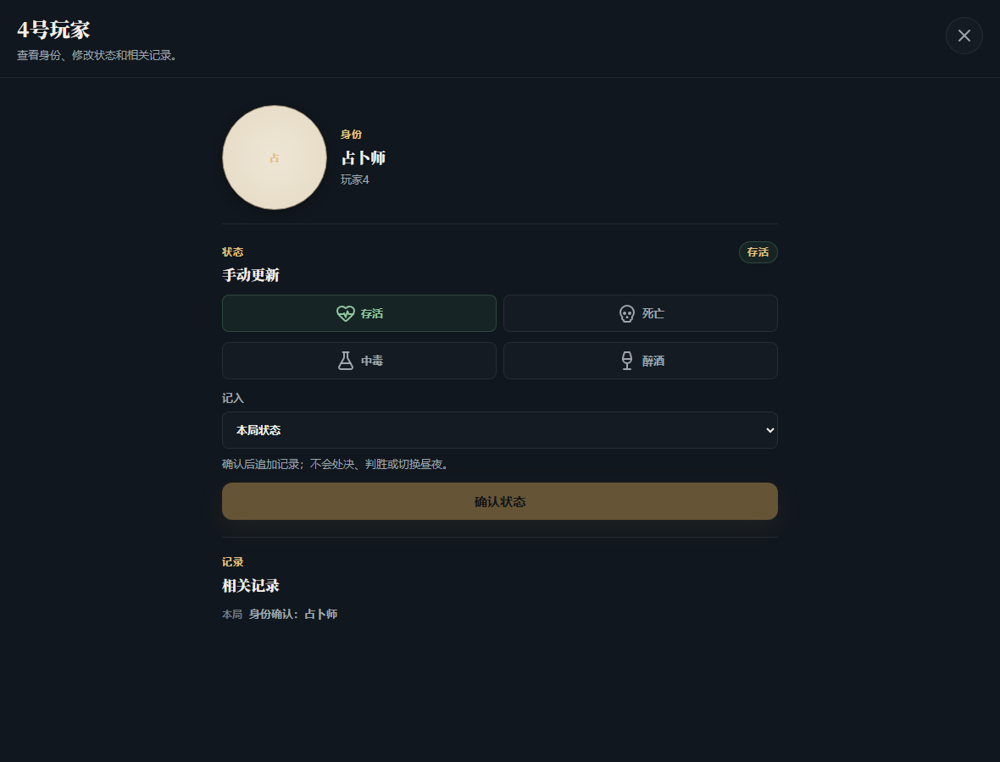 | 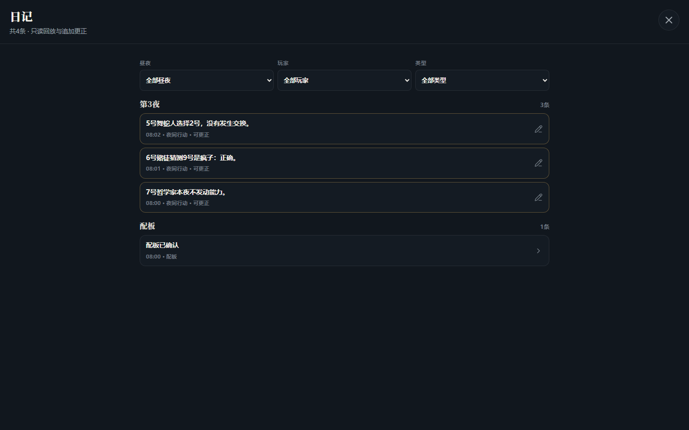 |

| 历史复盘 | 手机收尾 |
| --- | --- |
| 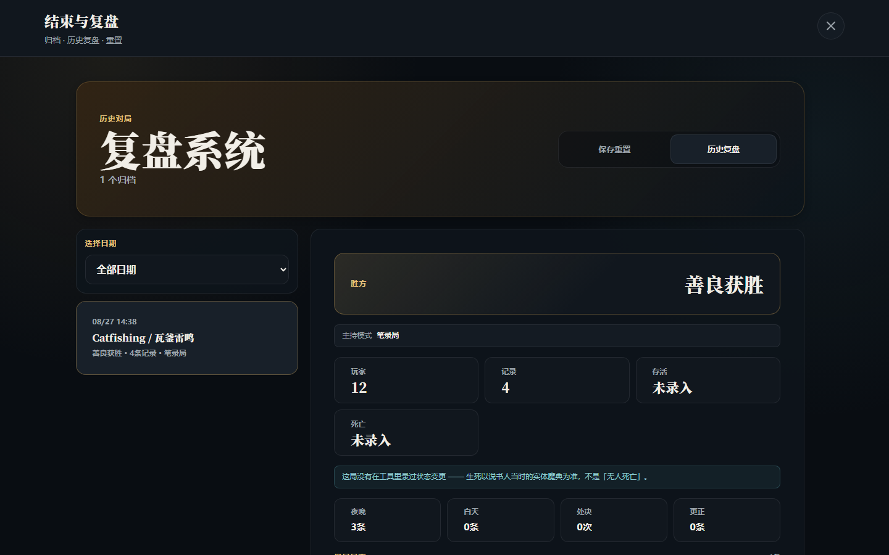 | 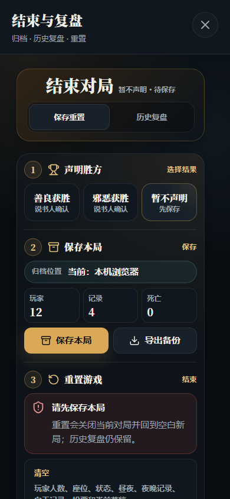 |

</details>

以上均由项目内的 12 人示例对局自动生成，不包含真实 API Key 或私人 VPS 信息。同一套功能可直接在手机、平板和电脑浏览器使用。截图中的角色图标由维护者在本机按素材清单下载后生成；角色原图不随 Git 仓库发布，来源与权利说明见 [THIRD_PARTY_NOTICES.md](THIRD_PARTY_NOTICES.md)。

根据个人理解制作的，AI血染钟楼说书人辅助工具，因为本人线下组局常常遇到这种问题，1.配板需要说书人非常熟悉技能，角色，有理解，才能配出比较好玩的板子，耗时长。2.技能结算，夜间处理长。3.投票记录麻烦。4.发送玩家身份太过古法，不够方便。5.全局日志需要手动记录。6.复盘评分复杂等问题。
当前内置 117 个智能板子。这里的“智能板子”不是一个 AI 模型，而是整理好的剧本知识包：里面有角色池、角色技能、首夜/其他夜夜序、7—15 人配板模板、人数规则和高风险提醒。AI 只是读取这些项目内资料，提供配板排序或夜间结果草稿；它不等于官方规则引擎，社区和自定义角色按项目中保存的角色说明使用。

它不是官方魔典，也不是线上游戏平台，更不是自动规则引擎。它的核心定位是：
帮说书人减少记录、配板、夜序、投票、复盘和规则判断时的脑力负担，但最终裁定权永远在说书人手里。

它适合的使用方式是：
说书人依然使用官方/实体魔典作为主要局面视角，同时在平板、电脑或 VPS 页面上打开这个工具，作为记录台和 AI 顾问。

如果手边没有实体魔典，可以在开局界面切到**魔典模式**，屏幕上会多出一张座位环来承担这个角色。
它默认是盖着的（只显示座位号与生死，角色与标记要长按才揭示），失焦或闲置会自动盖回去。
两种模式记的是同一份数据、走同一条代码路径，随时可以来回切——切回纯记录时会先把当前所有状态
列成一张可抄的清单，因为那之后状态就归你和实体魔典负责了。
边界与理由见 [dev-docs/GRIMOIRE_MODE_BOUNDARY.md](dev-docs/GRIMOIRE_MODE_BOUNDARY.md)。

## 智能板子到底用在哪里

一局游戏中，智能板子会被同一份 `scriptId` 贯穿使用：

1. **开局选板子和人数**：从当前板子的已录入模板中筛选角色组合、阵营构成和恶魔伪装。
2. **配板页**：本地模板先生成候选，AI 可选地帮忙排序、解释风险和提示玩家经验负担；“选择这套配板”只会建立草稿，还没有发送身份。
3. **夜间工作台**：按当前板子的首夜/其他夜夜序生成唤醒队列，并显示角色技能、目标输入和结果候选。
4. **夜间 AI 推荐**：读取当前角色、目标、状态和已记录历史，给出本项结果草稿；仍需说书人点击“确认并停留”或“确认并下一位”。
5. **投票、日志和复盘**：继续使用同一局的角色和板子上下文，方便更正和回看。

即使关闭真实 AI，模板、夜序、技能提示、手动记录和归档仍然可以使用。身份、阵营、死亡、毒醉、疯狂、胜负和昼夜推进，始终由说书人确认。
核心优势
1. 很贴合线下说书人的真实痛点
这个项目不是从“我要做一个线上血染钟楼”出发，而是从线下主持的真实麻烦出发：
开局要配板；
要考虑人数、玩家经验、趣味性、角色冲突；
夜晚要按夜序逐个唤醒；
每个角色技能要记录目标、结果、信息；
白天要记录提名、票型、处决；
出错后要能更正；
赛后还要能复盘。
它解决的是说书人主持时最累的那部分：
记不清、写不快、容易漏、规则复杂、复盘困难。

2. 不抢说书人的权威
这是很重要的优势。
很多类似工具容易走偏，变成：
自动结算技能；
自动改身份；
自动判死亡；
自动进昼夜；
自动判胜负。
这个项目明确不这么做。
AI 只能提供：
配板建议；
夜间结算建议；
规则提醒；
日志草稿；
复盘草稿。
但所有关键结果都必须由说书人确认：
身份；
阵营；
死亡；
中毒；
醉酒；
处决；
胜负；
昼夜推进。
这让它更像“副驾驶”，不是“代驾”。

3. 智能配板是核心亮点
普通工具最多只能导入板子，或者随机发身份。
这个项目的优势是会把板子做成“智能板子”。
智能板子不只是 JSON：
有角色池；
有夜序；
有 setup 影响；
有角色风险提醒；
有推荐配板模板；
有恶魔伪装建议；
有玩家经验参与考虑；
有 AI 解释为什么这样配。
对说书人来说，它不是简单随机，而是可以快速给出几套“能玩、合理、有趣”的候选组合。
尤其适合：
临时开局；
玩家经验不均；
不想每次都用同一套配置；
想让游戏更持久、更有戏剧性。

4. 夜晚工作台非常贴近主持流程
夜晚是血染钟楼最容易出错的部分。
这个项目的夜晚工作台不是简单列表，而是围绕“逐个唤醒”设计：
当前夜序；
当前角色；
当前玩家；
玩家昵称；
技能说明；
目标选择；
猜测角色；
受到影响；
AI 建议；
确认记录；
同步到日志。
优势是说书人可以按顺序处理，不容易漏人，也不需要边翻规则边手写。
它尤其适合复杂角色，比如：
赌徒；
舞蛇人；
洗脑师；
普卡；
诺-达鲺；
方古；
红唇女郎；
熬药女巫；
疯子；
数学家。
这些角色不应该自动结算，但 AI 可以提醒说书人该注意什么。

5. 白天投票和提名记录更结构化
线下白天投票也很容易乱：
谁提名谁；
几票；
是否超过门槛；
是否覆盖暂列；
是否平票；
谁最终被处决；
死亡票有没有用。
这个工具把这些内容做成结构化记录，不再只靠纸笔。
它不会自动杀人，而是帮你记录完整过程，最后由说书人确认。

6. 日志和更正体系是长期优势
这个项目很重视“可追溯”。
每晚行动、每次投票、每条信息、每次更正都可以进入日志。
如果说书人中途改了结果，不是简单覆盖，而是保留更正记录。
这很适合：
现场纠错；
复盘；
回看争议；
总结说书人操作；
后续 AI 复盘。
简单说，它把“手写纸”变成了可搜索、可分类、可复盘的记录。

7. 赛后复盘比普通日志更进一步
普通工具做到记录就结束了。
这个项目还做了复盘方向：
整局时间线摘要；
关键转折；
玩家关键行为摘录；
AI 锐评草稿；
每个玩家评语；
整局游戏节奏评价。
当然，它不会假装自己完全知道玩家发言和心理博弈。
它只能基于日志做草稿，但这个草稿足够帮说书人快速组织复盘。

8. 架构边界比较健康
这个项目有一个很大的优势：
它一直在防止变成屎山。
目前已经明确了很多边界：
不做完整规则引擎；
不做玩家常驻端；
不做官方魔典同步；
不做数据库/ORM 过度工程；
不把每个角色写成巨大 if/else；
不把 AI 建议直接写进权威状态；
多板子走智能板子包架构；
复杂角色走共享规则知识；
前端、后端、AI、板子数据都有分层。
这对长期维护很重要。
因为血染钟楼角色多、板子多、特殊规则多，如果一开始不设边界，后面一定会乱。

9. 支持自托管和 VPS
这个项目不是只能本地跑。
现在已经支持：
本地运行；
后端 runtime；
JSON 归档；
VPS 部署；
Windows Scheduled Task 托管；
GitHub Release；
自托管说明；
公开仓库边界说明。
这意味着它可以作为你自己的长期工具运行在 VPS 上，而不是只能开开发环境。


> **先读这个**：[dev-docs/DESIGN_INTENT.md](dev-docs/DESIGN_INTENT.md) 讲清楚这个工具为什么长成现在这样——
> 每一条看起来多余的摩擦、偏执的边界在防什么。它比功能清单更能帮你判断一个改动该不该做。

## AI 权限边界

AI 可以：

- 给配板候选；
- 解释候选为什么适合当前人数/玩家经验；
- 给夜间技能结算建议；
- 给玩家信息文案草稿；
- 提醒缺少目标、缺少历史信息、状态冲突或高风险规则；
- 生成赛后复盘草稿和玩家锐评草稿。

AI 不可以：

- 自动发送身份；
- 自动执行技能；
- 自动改变身份、阵营、死亡、毒醉或疯狂状态；
- 自动判定胜负；
- 自动进入下一昼夜；
- 把建议写成权威裁定。

## 不做什么

- 不自动运行完整规则；
- 不自动判定胜负；
- 不自动改身份、阵营、死亡、毒醉；
- 不自动执行技能；
- 不同步或操作官方魔典；
- 不做常驻玩家端/收件箱；
- 不把 AI 建议当权威裁定；
- 不把官方/社区素材直接随公开仓库发布。

## 快速开始

第一次使用可以在开局页点击 **“新手教学 · 2分钟看懂一局”**。教学按“主持方式 → 配板 → 发身份 → 夜晚 → 白天 → 保存复盘”分成 6 步，每次只显示当前一步；正式开局后也能从顶部阶段栏的 **“新手教学”** 随时重新打开。

### 手机和平板（PWA）

1. 用浏览器打开项目的 **HTTPS 部署地址**。
2. 不熟悉项目时先打开“新手教学”；它不会修改游戏数据，也不会强制你走完。
3. 首次进入先选择主持方式并继续设置本局；“安装到主屏幕”是可选项，不安装也能直接使用。Android/Chrome 可用浏览器菜单的“安装应用”或“添加到主屏幕”，iPhone/iPad 使用 Safari 分享菜单里的“添加到主屏幕”。
4. 接着明确选择“桌上有实体魔典”或“没有实体魔典”，再点“继续：选择板子和人数”；回访时会沿用上次选择，不重复展示完整引导。
5. 第一次保持联网，等页面完整打开；以后断网仍可进入核心手动主持流程。
6. 对局默认保存在当前浏览器。换设备、清浏览器数据或重装前，在“应用设置 → 导出与恢复当前对局”导出 JSON；新设备选择该文件、核对摘要后再确认恢复。

安装和版本更新不会在对局中强制刷新。断网时真实 AI、后端连通测试和云端归档不可用，但本机记录不应因此中断。

### 源码开发

需要 Node.js `^20.19.0` 或 `>=22.12.0`。Windows 普通用户优先下载自带运行环境的便携包，无需单独安装 Node.js。

```powershell
npm install
npm run dev
```

打开 Vite 输出的本地地址，默认进入“本局”。

## 本地后端

构建并启动本地 runtime：

```powershell
npm run dev:backend
```

默认：

- host: `127.0.0.1`
- port: `8787`
- archive data: `data/archives/archives.json`

可参考 `.env.example` 设置环境变量。

## AI 配置

真实 AI 走后端代理。GitHub 下载版默认不带 API Key；用户可以在页面设置里填写并保存自己的 Key，供之后的配板、夜间建议和赛后复盘使用。页面保存会把配置写入当前站点在当前浏览器里的 `localStorage`：关闭页面或重开应用后仍可继续使用，但不会因此上传到 GitHub，也不会变成服务器端保存的 Key。清除该站点数据、换浏览器或换设备后需要重新填写；共享设备/VPS 仍建议使用后端环境变量。

当前状态：

- 后端已有 OpenAI-compatible provider 配置和一次性 live test 入口。
- 默认 `BOTC_AI_ENABLED=false`，不调用真实模型。
- 设置页选择“使用后端配置”时，真实请求读取后端的 `BOTC_AI_BASE_URL`、`BOTC_AI_MODEL` 和 `BOTC_AI_API_KEY`。
- 设置页选择“兼容接口”并保存后，本机运行版会在后续配板、夜间和复盘请求中继续使用当前浏览器保存的地址、模型和 Key。
- 只有本机或 HTTPS 后端会携带浏览器保存的 Key；普通 HTTP 公网地址不会携带这份 Key，并回退到后端配置或本地草稿。
- 浏览器 `localStorage` 不是密码保险箱；公共电脑、多人共用浏览器或安装了不可信扩展的环境不要保存 Key。可在设置中恢复默认，或清除该站点数据来删除浏览器内保存的配置。
- AI 配板、夜间结算和赛后复盘仍是草稿建议；不会自动改权威状态。
- 详细启动方式见 `dev-docs/AI_RUNTIME_STARTUP.md`。

环境变量示例：

```powershell
$env:BOTC_AI_ENABLED='true'
$env:BOTC_AI_PROVIDER='openai-compatible'
$env:BOTC_AI_BASE_URL='https://api.example.com/v1'
$env:BOTC_AI_MODEL='your-model-name'
$env:BOTC_AI_API_KEY='your-local-secret'
```

## 自托管 / VPS

本项目可以本机运行，也可以部署到自用 VPS。推荐先看：

- `dev-docs/SELF_HOSTING_RUNBOOK.md`：从本机验证、打包、VPS 同步、启动、健康检查、备份到回滚的完整说明。
- `dev-docs/VPS_DEPLOYMENT_PREP.md`：当前自用 VPS 与旧 V2.5 的目录、端口和共存边界。
- `dev-docs/AI_RUNTIME_STARTUP.md`：真实 AI provider 的环境变量和连通测试。

关键边界：API Key 不进源码、GitHub、归档或响应；可按场景保存在当前浏览器或后端环境变量；归档数据默认是 JSON 文件；AI 不可用时，手动主持流程仍必须可用。
VPS 默认只绑定 `127.0.0.1`；公网访问应由同机反向代理转发，通常不需要改变这个绑定。只有明确知道自己在防火墙和代理层已经做好保护时，才传入 `-AllowPublicBind`。不要直接把 runtime 端口裸露到公网。

### 公开分享模式

默认不启用公开模式，现有本机和自用 VPS 行为保持兼容。要把 HTTPS 页面分享给普通用户时，必须显式设置：

```powershell
$env:BOTC_PUBLIC_ACCESS_MODE='true'
$env:BOTC_PUBLIC_AI_ALLOWED_HOSTS='api.example.com'
node dist-server\runtime.mjs
```

公开模式的边界：

- 匿名开放静态页面、PWA 资源和 `/healthz`。
- 匿名用户仍可完整使用当前浏览器里的对局、本机归档、导出恢复和离线手动主持流程。
- `/api/archives*`、`/api/recovery/*` 和使用 VPS 自有 Key 的 AI 能力不对匿名用户开放。
- `BOTC_PUBLIC_AI_ALLOWED_HOSTS` 是可选 BYOK 白名单，填写逗号分隔的 provider 主机名；只接受白名单中的 HTTPS 服务。留空表示公开模式不提供真实 AI 代理。
- BYOK 必须由用户提交完整的接口地址、模型和自己的 Key，不会缺一项后回退使用 VPS Key；公网模式下 AI 请求体上限为 1 MiB，同一 runtime 可见来源地址每分钟最多 10 次 AI 请求。
- 隐藏 VPS 地址不是安全措施。地址可能被转发或扫描发现，安全边界必须由运行模式、反向代理、防火墙和后端拒绝规则共同提供。

公开模式已通过源码测试、生产后端构建和本机 HTTP smoke；真正上线仍需按自托管手册配置 HTTPS 反向代理和防火墙，并在 VPS 部署后再次验收。当前限流只读取 runtime 看到的连接地址；反向代理部署可能让所有公网用户共享同一限额，正式开放 BYOK 前应结合代理配置和实际流量复核。

## 验证

```powershell
npm run check
npm run test:e2e
npm run test:e2e:pwa
npm run test:e2e:mobile-audit
npm run verify:pwa
npm run smoke:backend
npm run smoke:ai-night-live
npm run audit:public
```

`audit:public` 用于拦截真实 API Key、本机个人路径和素材误提交风险。
`smoke:ai-night-live` 是可选真实模型抽查，运行前必须设置 `BOTC_AI_BASE_URL`、`BOTC_AI_MODEL` 和 `BOTC_AI_API_KEY`；默认检查不会调用真实模型。

刷新 GitHub 展示截图：

```powershell
npm run screenshots:github
```

## 公开仓库与素材包

代码可以公开整理；官方/社区二进制素材默认不提交。

本地素材目录：

- `public/assets/characters/`
- `public/assets/community/`

保留来源说明：

- `public/assets/characters/source-manifest.json`
- `public/assets/community/README.md`
- `public/assets/community/source-manifest.json`
- `THIRD_PARTY_NOTICES.md`

详细边界见 `dev-docs/PUBLIC_RELEASE_BOUNDARY.md`。

## 项目文档

- `dev-docs/README.md`：文档索引和当前路线。
- `dev-docs/PRODUCT_VISION.md`：产品定位。
- `dev-docs/AI_AUTHORITY_BOUNDARY.md`：AI 权限边界。
- `dev-docs/SCRIPT_ARCHITECTURE_PLAN.md`：智能板子包架构。
- `dev-docs/RULE_RESEARCH_PROTOCOL.md`：新增板子前的规则调研。
- `dev-docs/ABILITY_SETTLEMENT_BOUNDARY.md`：技能结算建议边界。
- `dev-docs/AI_INTEGRATION_PLAN.md`：真实 AI 接入和上下文最小化。
- `dev-docs/SMOKE_HOSTING_SCENARIOS.md`：模拟主持流程验收。
- `dev-docs/GITHUB_RELEASE_CHECKLIST.md`：GitHub 发布检查清单。
- `dev-docs/GITHUB_PUBLICATION_STATUS.md`：GitHub 公开发布状态。
- `dev-docs/releases/alpha-preview-20260817.md`：当前 `0.1.0-alpha.3` Release Notes 草稿。

## 第三方与免责声明

见 `THIRD_PARTY_NOTICES.md`。

本项目是社区制作的非官方辅助原型。Blood on the Clocktower、相关角色、概念、脚本、视觉资产和官方资源属于其各自权利人。

## License

The original source code and original project documentation in this repository are licensed under the MIT License. See `LICENSE`.

This MIT License does not grant any rights to Blood on the Clocktower, official or community scripts, role names, rules text, visual assets, trademarks, provider-owned materials, or any third-party content. See `THIRD_PARTY_NOTICES.md`.

## Windows 零安装便捷包

普通使用者无需安装 Node.js、npm 或开发工具。请在 GitHub Release 下载 `botc-storyteller-companion-windows-portable.zip`，完整解压后双击根目录 `启动血染钟楼AI说书人工具.cmd`。便捷包内置经过官方 SHA-256 校验的 Node.js LTS 运行时及其许可证。

首次启动会先询问是否安装角色图标：用户确认来源和使用提示后，启动器从 TPI Toolmaker Resources、GStone 及清单记录的社区来源下载当前智能板子所需素材，逐文件校验 SHA-256，并安装 Community Created Content 标识。当前清单覆盖 718 个角色图标（约 102 MB）；基础便捷包与 Git 仓库仍不包含这些二进制素材。随后可以配置 AI，也可以跳过；夜序、记录、投票、日志和归档不依赖 AI。配置只保存在本机 `.env`，不会随仓库发布。

简洁教程：[`安装教程.md`](安装教程.md)。完整说明：[`docs/QUICK_START_WINDOWS.md`](docs/QUICK_START_WINDOWS.md)。开发者仍可使用 `npm install`、`npm run dev` 和 `npm run dev:backend`。

> GitHub 的 **Code → Download ZIP** 是源码包，不是零安装便捷包。普通使用者只下载 Releases 中名称完全一致的 portable ZIP。

中文说明：本仓库原创代码和原创项目文档按 MIT License 授权；但该授权不包含 Blood on the Clocktower 相关内容、官方/社区脚本、角色名、规则文本、视觉素材、商标或第三方提供方材料。
